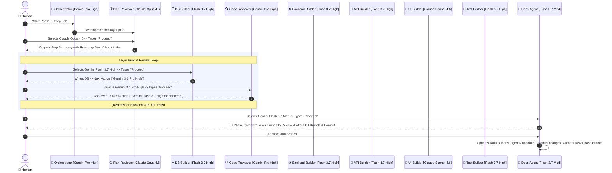

# Agent Pipeline Architecture

> **Status:** Active  
> **Version:** 2.2.4 (Roadmap Step Indicator & Quota-Optimized)  
> **Last Updated:** 2026-08-17

This document defines the modular, multi-model agent pipeline for Open Welfare. It is optimized for zero-overhead token usage, preservation of Claude weekly quotas by leveraging **Gemini Flash 3.7 High** for heavy building tasks, and surgical use of **Claude Opus 4.6** and **Claude Sonnet 4.6** for architectural planning and UI fidelity.

---

## 1. Multi-Model Tier Strategy (Quota-Optimized)

| Tier | Role / Phase | Recommended Model | Why This Model |
|---|---|---|---|
| **Tier 1 (Reasoning)** | 🧠 Orchestrator | **Gemini 3.1 Pro (High)** | Deep system architecture, PRD ↔ Schema alignment, layer decomposition (Google AI Pro) |
| **Tier 1 (Reasoning)** | 📋 Plan Reviewer | **Claude Opus 4.6 (Thinking)** | **Surgical Claude spot:** Cross-vendor audit of Gemini's architectural plan (~2K tokens only) |
| **Tier 1 (Reasoning)** | 🔍 Code Reviewer | **Gemini 3.1 Pro (High)** | High-reasoning code audit, catches edge cases without burning Claude limits |
| **Tier 2 (Building)** | 🗄️ DB Builder | **Gemini Flash 3.7 (High)** | Fast, precise PostgreSQL DDL & Supabase RLS policies (0 Claude quota) |
| **Tier 2 (Building)** | ⚙️ Backend Builder | **Gemini Flash 3.7 (High)** | Clean TypeScript service layer, error encapsulation (0 Claude quota) |
| **Tier 2 (Building)** | 🔌 API Builder | **Gemini Flash 3.7 (High)** | Pattern-following Zod validation & Next.js Server Actions (0 Claude quota) |
| **Tier 2 (Building)** | 🎨 UI Builder | **Claude Sonnet 4.6 (Thinking)** | React Server Components, Tailwind CSS, clean design precision |
| **Tier 2 (Building)** | 🧪 Test Builder | **Gemini Flash 3.7 (High)** | Massive context capacity to ingest all layer files and write Vitest + Playwright suites |
| **Tier 3 (Utility)** | 📝 Docs & Git Agent | **Gemini Flash 3.7 (Medium)** | Low-cost markdown updates, git commit/push generation, cleanup |

---

## 2. Standard Completion Footer Format

Every agent MUST conclude its output with this exact format (including the Roadmap Step indicator):

```markdown
---
#### 🏁 Step Summary & Next Action
📍 **Roadmap Step:** [e.g. Phase 3, Step 3.1 — Campaign Database Schema & API]  
👤 **Current Agent:** [e.g. ⚙️ Backend Builder]  
🤖 **Model Used:** [Current Active Model]  
📊 **Status:** ✅ [Summary of completed step]  
⏭️ **Next Agent:** [e.g. 🔍 Code Reviewer]  
👉 **Next Action:** Switch model to `[Recommended Next Model]` and type `"Proceed"`
---
```

---

## 3. The Interactive Pipeline Lifecycle



---

## 4. Phase Completion, Pull Request & Branching Protocol

Whenever a development phase is completed and approved:
1. **Commit Previous Phase:** Commit all working migrations, services, actions, UI components, tests, and updated documentation on the active branch:
   ```bash
   git add .
   git commit -m "feat(<phase>): complete <phase-name> (closes Phase X)"
   ```
2. **Open Pull Request to Main:** Create a pull request targeting `main` to merge the completed phase code:
   ```bash
   git push origin <active-phase-branch>
   gh pr create --base main --head <active-phase-branch> --title "feat: Phase X — <Phase Name>" --body "..."
   ```
3. **Branch for New Phase:** Create and switch to a dedicated feature branch for the upcoming phase before any code or planning is initialized:
   ```bash
   git checkout -b phase-<number>-<feature-name>
   ```
4. **Clean Ephemeral Workspace:** Reset `.agents/.handoff/` so the new phase begins with an uncluttered context workspace.

