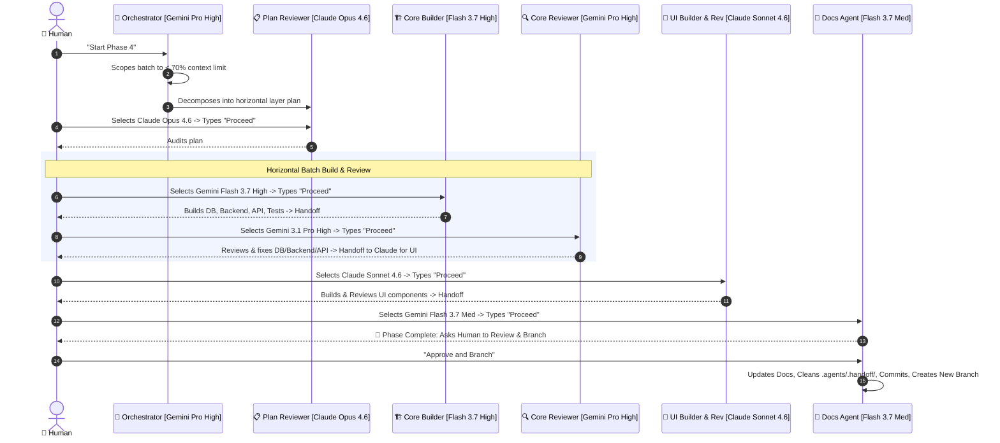

# Agent Pipeline Architecture

> **Status:** Active  
> **Version:** 3.0.0 (Horizontal Layer Batching & Context-Optimized)  
> **Last Updated:** 2026-08-17

This document defines the modular, multi-model agent pipeline for Open Welfare. It has been optimized to **minimize model switching** by horizontally batching tasks by layer, while strictly maintaining a **<70% context window limit** to ensure high reasoning quality.

---

## 1. Multi-Model Tier Strategy & Batching Rules

### Context Limit Rule
The Orchestrator must scope work into phase-wide batches (or sub-batches) ensuring that the executing model's context window will **not exceed 70%**. If a phase is too large, it must be split into multiple horizontal batches.

### Model Consolidation & Handoff Rule
To minimize switching:
1. **Gemini Flash 3.7 (High)** handles as much building as possible (DB, Backend, API, Tests) in one continuous session, up to its 70% context limit.
2. **Gemini 3.1 Pro (High)** performs the Code Review for all of Flash 3.7's work, making necessary corrections directly. 
3. **Claude Sonnet 4.6** is then handed the baton to build and review the UI layer. 
*Handoffs must explicitly summarize context before the model switch clears the context window.*

| Tier | Role / Phase | Recommended Model | Why This Model |
|---|---|---|---|
| **Tier 1 (Reasoning)** | 🧠 Orchestrator | **Gemini 3.1 Pro (High)** | Scopes tasks to <70% context, plans horizontal layer batches. |
| **Tier 1 (Reasoning)** | 📋 Plan Reviewer | **Claude Opus 4.6 (Thinking)** | Cross-vendor audit of the architectural plan. |
| **Tier 2 (Building)** | 🏗️ Core Builder | **Gemini Flash 3.7 (High)** | Builds DB, Backend, API, and Tests in a single batched run. |
| **Tier 1 (Reviewing)** | 🔍 Core Reviewer | **Gemini 3.1 Pro (High)** | Reviews all Core Builder work and makes fixes before UI handoff. |
| **Tier 2 (Building/UI)** | 🎨 UI Builder & Reviewer | **Claude Sonnet 4.6 (Thinking)** | Builds and reviews UI components, React Server Components, Tailwind. |
| **Tier 3 (Utility)** | 📝 Docs & Git Agent | **Gemini Flash 3.7 (Medium)** | Low-cost markdown updates, git commit/push generation, cleanup. |

---

## 2. Standard Completion Footer Format

Every agent MUST conclude its output with this exact format (including the Roadmap Step indicator and Context check):

```markdown
---
#### 🏁 Step Summary & Next Action
📍 **Phase/Batch:** [e.g. Phase 4 — Beneficiary Core Batch 1]  
👤 **Current Agent:** [e.g. 🏗️ Core Builder]  
🤖 **Model Used:** [Current Active Model]  
📈 **Context Estimate:** [e.g. ~45% (Safe)]  
📊 **Status:** ✅ [Summary of completed step]  
⏭️ **Next Agent:** [e.g. 🔍 Core Reviewer]  
👉 **Next Action:** Switch model to `[Recommended Next Model]` and type `"Proceed"`
---
```

---

## 3. The Interactive Pipeline Lifecycle



---

## 4. Phase Completion, Pull Request & Branching Protocol

Whenever a development phase is completed and approved:
1. **Commit Previous Phase:** Commit all working migrations, services, actions, UI components, tests, and updated documentation on the active branch:
   ```bash
   git add .
   git commit -m "feat(<phase>): complete <phase-name> (closes Phase X)"
   ```
2. **Open Pull Request to Main:** Create a pull request targeting `main` to merge the completed phase code:
   ```bash
   git push origin <active-phase-branch>
   gh pr create --base main --head <active-phase-branch> --title "feat: Phase X — <Phase Name>" --body "..."
   ```
3. **Branch for New Phase:** Create and switch to a dedicated feature branch for the upcoming phase before any code or planning is initialized:
   ```bash
   git checkout -b phase-<number>-<feature-name>
   ```
4. **Clean Ephemeral Workspace & Advance State:** Purge numbered intermediate scratch artifacts (`00-plan.md`, `01-*.json`, etc.) from `.agents/.handoff/`. **NEVER delete `state.json`** — instead, the Docs Agent must update `state.json` to transition to the new phase with `current_layer: "planning"`, `next_agent: "orchestrator"`, and `recommended_next_model: "Gemini 3.1 Pro (High)"`.
