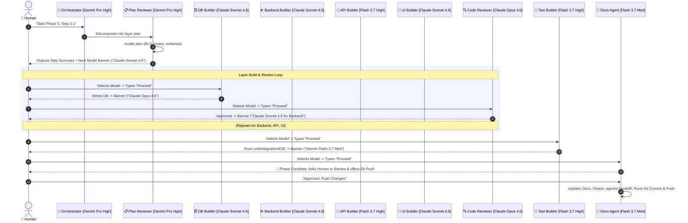

# Agent Pipeline Architecture

> **Status:** Active  
> **Version:** 2.0.0  
> **Last Updated:** 2026-08-17

This document defines the modular, multi-model agent pipeline for Open Welfare. It is optimized for zero-overhead token usage, human-in-the-loop phase reviews, and autonomous review-redo loops.

---

## 1. Multi-Model Tier Strategy

| Tier | Role / Phase | Recommended Model | Why This Model |
|---|---|---|---|
| **Tier 1 (Reasoning)** | 🧠 Orchestrator & 📋 Plan Reviewer | **Gemini 3.1 Pro (High)** | High-level system architecture, PRD ↔ Schema alignment, deep decomposition |
| **Tier 1 (Reasoning)** | 🔍 Code Reviewer | **Claude Opus 4.6** *(or Gemini 3.1 Pro High)* | Deep line-level code audit, structural edge-case detection |
| **Tier 2 (Building)** | 🗄️ DB Builder | **Claude Sonnet 4.6** | Robust PostgreSQL DDL & RLS security policy syntax |
| **Tier 2 (Building)** | ⚙️ Backend Builder | **Claude Sonnet 4.6** | Typed TypeScript service layer, error encapsulation |
| **Tier 2 (Building)** | 🔌 API Builder | **Gemini Flash 3.7 (High)** | Fast, pattern-following Zod validation & Next.js Server Actions |
| **Tier 2 (Building)** | 🎨 UI Builder | **Claude Sonnet 4.6** | RSC-first architecture, Tailwind CSS, clean accessibility |
| **Tier 2 (Building)** | 🧪 Test Builder | **Gemini Flash 3.7 (High)** | Massive context capacity to ingest all layer files and write Vitest + Playwright suites |
| **Tier 3 (Utility)** | 📝 Docs & Git Agent | **Gemini Flash 3.7 (Medium)** | Low-cost markdown updates, git commit/push generation, cleanup |

---

## 2. The Interactive Pipeline Lifecycle



---

## 3. Core Protocols & Rules

### A. Ephemeral Handoff Protocol (`.agents/.handoff/`)
To prevent token bloat across chat sessions and avoid long-term git clutter:
1. All inter-agent data is saved inside `.agents/.handoff/`:
   - `state.json` (tracks active phase, current layer, next pending agent, recommended model)
   - `00-plan.md`, `01-db.md`, `02-backend.md`, `03-api.md`, `04-ui.md`, `05-review.md`, `06-test.md`
2. `.agents/.handoff/` is listed in `.gitignore` so temporary files are never pushed.
3. Upon final phase approval, the **Docs Agent automatically purges `.agents/.handoff/`** to keep the workspace completely clean.

### B. Zero-Instruction Prompting ("Just Say Proceed")
The human is **never required** to re-explain the task or pass file paths between agents.
* Every agent checks `.agents/.handoff/state.json` on startup.
* When the human selects the recommended model and simply prompts `"Proceed"` (or `"Next"`), the active agent autonomously reads the previous stage's handoff file and executes.

### C. Standard Completion Footer (Required on Every Agent Turn)
Every agent MUST conclude its output with this exact standardized banner:

```markdown
---
### 🏁 Step Summary & Next Action
- **Current Agent:** [e.g., 🗄️ DB Builder]
- **Model Used:** [Current Active Model]
- **Status:** ✅ Completed / ⚠️ Redo Requested
- **Next Agent:** [e.g., 🔍 Code Reviewer]
- **👉 Recommended Model in Picker:** `[e.g., Claude Opus 4.6 (Thinking)]`
- **Action:** Switch the model in your picker and type `"Proceed"`.
---
```

### D. Model Mismatch Detection
If the active model does not match the recommended model for an agent, the agent must output a friendly notice before executing:
> ⚠️ **Model Notice:** Recommended model for this task is `[Recommended Model]`, but currently running on `[Active Model]`. Proceeding with current model.

### E. Reviewer Rejection & Redo Protocol
Reviewer agents (Plan Reviewer, Code Reviewer, Test Builder) are strict quality gates:
1. If code or architecture is flawed, the Reviewer rejects it and writes exact issue descriptions and suggestions to `.agents/.handoff/`.
2. The Reviewer explicitly alerts the human:
   > 🛑 **Revision Required for [Layer]**: [Reason]  
   > 👉 **Please select `[Builder Model]` and type `"Proceed"` to redo this step.**
3. The Builder reads the feedback, fixes the implementation, and re-submits to the Reviewer (up to 3 cycles).

### F. Human Phase Review & Automated Git Commit
Human review takes place **at the end of the entire phase**:
1. After all tests pass, the **Docs Agent** presents a comprehensive summary of everything built and tested.
2. It explicitly prompts:
   > 🔍 **Phase [X] is fully implemented and tested. Please verify if everything works as expected.**  
   > If satisfied, type **"Approve and Push"** to commit and push changes.
3. When approved, it updates the roadmap, cleans up `.agents/.handoff/`, generates a clean commit message, and executes:
   ```bash
   git add .
   git commit -m "feat(<scope>): <description>"
   git push
   ```
